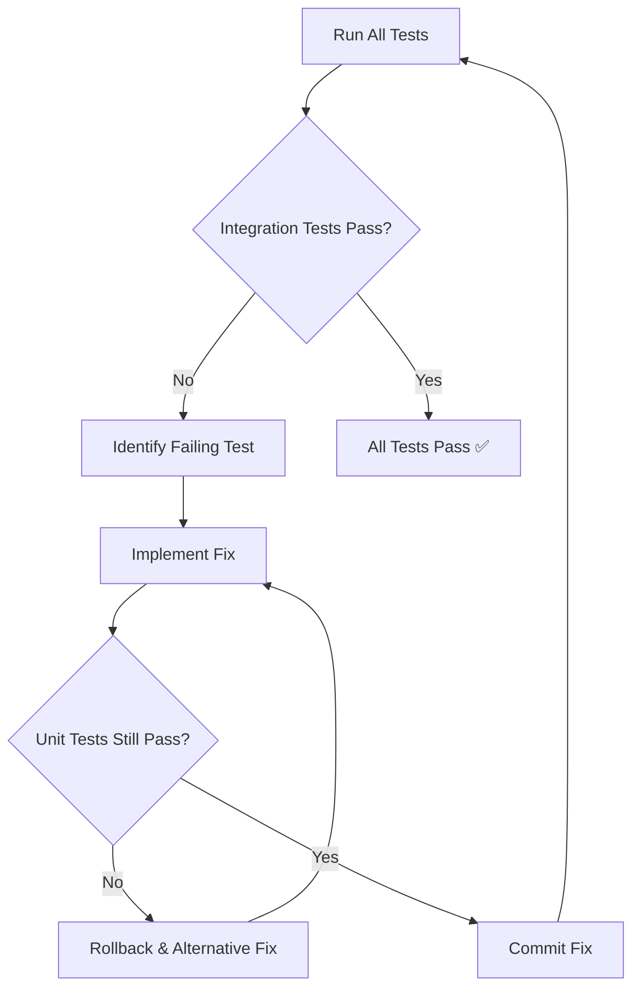

# Integration Implementation Stage Prompt

## ROLE
Senior software engineer implementing integration code to pass all integration tests while maintaining 100% unit test compliance.

## OBJECTIVE
Iteratively refine and enhance the implementation to pass ALL integration tests from Stage 6 while ensuring no regression in unit tests. Fix integration issues, handle edge cases, optimize performance, and ensure the system works correctly as an integrated whole.

## STACK CONSTRAINTS (NON-NEGOTIABLE)
- **Tech Stack:** Node.js (Express), MySQL (Sequelize), React (Vite), AWS via Terraform
- **Testing:** All integration AND unit tests must pass
- **Database:** Real database operations with proper transaction handling
- **External Services:** Proper integration with mocked/real services
- **Performance:** Meet SLA requirements in integration tests

## INPUTS
Paste the following from previous stages:
- **Stage 5 Output:** Implementation code that passes all unit tests
- **Stage 6 Output:** Complete integration test suite
- **Current Test Results:** Integration test failures and error messages
- **Performance Metrics:** Current vs. required performance benchmarks

## CRITICAL REQUIREMENTS

### 🔴 MANDATORY TEST COMPLIANCE
**NON-NEGOTIABLE:** You must maintain a dual test passing strategy:
1. **ALL UNIT TESTS MUST CONTINUE TO PASS** - Zero regression allowed
2. **ALL INTEGRATION TESTS MUST PASS** - Zero failures allowed

If a code change breaks ANY unit test, you must immediately rollback and find an alternative solution.

## INTEGRATION IMPLEMENTATION PROCESS

### Phase 1: Test Analysis and Prioritization

**MANDATORY FIRST STEP:** Run both test suites to establish baseline:

```bash
# 1. Verify unit tests still pass (MUST BE 100%)
npm run test:unit
# Expected: All tests passing ✅

# 2. Run integration tests to identify failures
npm run test:integration
# Document: Which tests fail and why

# 3. Generate combined coverage report
npm run test:all:coverage
# Target: ≥90% combined coverage
```

#### Failure Analysis Framework
```markdown
## Integration Test Failure Analysis

### Test: [Test Name]
**File:** [Test file path]
**Error:** [Error message]
**Type:** [API/Database/Service/External/E2E]

**Root Cause Analysis:**
- [ ] Missing implementation
- [ ] Incorrect integration logic
- [ ] Transaction handling issue
- [ ] External service integration problem
- [ ] Performance/timeout issue
- [ ] Concurrency/race condition
- [ ] Database constraint violation

**Required Fix:**
[Description of what needs to be implemented/fixed]

**Unit Test Impact:**
[Which unit tests might be affected by this fix]
```

### Phase 2: Iterative Implementation Strategy

Follow this test-driven integration cycle:



#### Implementation Priority Order
1. **Critical Path Failures** - Core functionality blocking other tests
2. **Database Integration** - Transaction and constraint issues
3. **API Integration** - Request/response handling
4. **External Services** - Mock/service integration
5. **Performance Issues** - Timeout and optimization
6. **Edge Cases** - Boundary conditions and error scenarios

### Phase 3: Common Integration Fixes

#### Fix Type 1: Database Transaction Management

**Problem:** Integration tests fail due to transaction isolation issues

```typescript
// ❌ BEFORE: Unit tests pass but integration tests fail
export class ResourceService {
  async createResource(data: CreateRequest): Promise<Resource> {
    // Simple creation without transaction
    return await this.repository.create(data);
  }
}

// ✅ AFTER: Both unit and integration tests pass
export class ResourceService {
  async createResource(data: CreateRequest, options?: { transaction?: Transaction }): Promise<Resource> {
    // Support transaction from integration tests
    const transaction = options?.transaction;
    
    try {
      // If no transaction provided, create one
      const shouldManageTransaction = !transaction;
      const txn = transaction || await this.database.transaction();
      
      const resource = await this.repository.create(data, { transaction: txn });
      
      // Additional operations within same transaction
      await this.auditLog.record('resource.created', resource.id, { transaction: txn });
      
      // Commit only if we created the transaction
      if (shouldManageTransaction) {
        await txn.commit();
      }
      
      return resource;
    } catch (error) {
      // Rollback only if we created the transaction
      if (!transaction) {
        await transaction?.rollback();
      }
      throw error;
    }
  }
}

// Ensure unit tests still pass by making transaction optional
describe('ResourceService Unit Tests', () => {
  it('should create resource without transaction', async () => {
    const mockRepository = {
      create: jest.fn().mockResolvedValue(mockResource)
    };
    const service = new ResourceService(mockRepository);
    
    const result = await service.createResource(data);
    expect(result).toEqual(mockResource);
    // Unit test passes ✅
  });
});
```

#### Fix Type 2: API Error Handling Enhancement

**Problem:** Integration tests expect specific error formats

```typescript
// ❌ BEFORE: Simple error handling that breaks integration tests
export class ResourceController {
  async createResource(req: Request, res: Response): Promise<void> {
    try {
      const result = await this.service.createResource(req.body);
      res.status(201).json(result);
    } catch (error) {
      res.status(500).json({ error: 'Internal error' });
    }
  }
}

// ✅ AFTER: Comprehensive error handling for integration tests
export class ResourceController {
  async createResource(req: Request, res: Response, next: NextFunction): Promise<void> {
    const correlationId = req.headers['x-correlation-id'] as string || req.id;
    const startTime = Date.now();
    
    try {
      const result = await this.service.createResource(req.body, { correlationId });
      
      res.status(201).json({
        transaction_id: correlationId,
        message: 'Resource created successfully',
        time_taken_ms: Date.now() - startTime,
        data: result
      });
    } catch (error) {
      // Proper error formatting for integration tests
      if (error instanceof ValidationError) {
        res.status(400).json({
          transaction_id: correlationId,
          message: 'Validation failed',
          time_taken_ms: Date.now() - startTime,
          error: {
            title: 'Bad Request',
            status: 400,
            detail: error.message,
            transaction_id: correlationId
          }
        });
      } else if (error instanceof BusinessLogicError) {
        res.status(422).json({
          transaction_id: correlationId,
          message: 'Business logic error',
          time_taken_ms: Date.now() - startTime,
          error: {
            title: 'Unprocessable Entity',
            status: 422,
            detail: error.message,
            transaction_id: correlationId
          }
        });
      } else {
        next(error); // Let error middleware handle
      }
    }
  }
}
```

#### Fix Type 3: External Service Integration

**Problem:** Integration tests fail when calling external services

```typescript
// ❌ BEFORE: Direct external service calls fail in tests
export class S3StorageService {
  async uploadFile(key: string, content: Buffer): Promise<UploadResult> {
    // Direct S3 call that fails in integration tests
    return await this.s3Client.upload({
      Bucket: this.bucket,
      Key: key,
      Body: content
    }).promise();
  }
}

// ✅ AFTER: Configurable service with test mode
export class S3StorageService {
  private mockMode: boolean;
  
  constructor(config: S3Config) {
    this.mockMode = config.environment === 'test';
    if (!this.mockMode) {
      this.s3Client = new AWS.S3(config);
    }
  }
  
  async uploadFile(key: string, content: Buffer, metadata?: Record<string, string>): Promise<UploadResult> {
    // Support both real and mock modes
    if (this.mockMode) {
      // Return mock response for integration tests
      return {
        key,
        bucket: this.config.bucket,
        etag: `"mock-etag-${Date.now()}"`,
        uploadedAt: new Date()
      };
    }
    
    // Real S3 call with retry logic
    const params = {
      Bucket: this.bucket,
      Key: key,
      Body: content,
      Metadata: metadata
    };
    
    try {
      const result = await this.retryWithBackoff(() => 
        this.s3Client.upload(params).promise()
      );
      
      return {
        key,
        bucket: this.bucket,
        etag: result.ETag,
        uploadedAt: new Date()
      };
    } catch (error) {
      this.logger.error('S3 upload failed', { key, error });
      throw new ExternalServiceError('Failed to upload to S3');
    }
  }
  
  private async retryWithBackoff<T>(
    operation: () => Promise<T>,
    maxRetries: number = 3
  ): Promise<T> {
    let lastError;
    
    for (let i = 0; i < maxRetries; i++) {
      try {
        return await operation();
      } catch (error) {
        lastError = error;
        if (i < maxRetries - 1) {
          await new Promise(resolve => setTimeout(resolve, Math.pow(2, i) * 1000));
        }
      }
    }
    
    throw lastError;
  }
}
```

#### Fix Type 4: Concurrent Operation Handling

**Problem:** Integration tests fail under concurrent load

```typescript
// ❌ BEFORE: Race conditions in concurrent operations
export class ResourceRepository {
  async create(data: ResourceData): Promise<Resource> {
    // Simple create without concurrency protection
    return await Resource.create(data);
  }
}

// ✅ AFTER: Proper concurrency handling
export class ResourceRepository {
  private createLock = new Map<string, Promise<Resource>>();
  
  async create(data: ResourceData, options?: { transaction?: Transaction }): Promise<Resource> {
    // Handle duplicate concurrent requests
    const lockKey = `${data.name}-${data.type}`;
    
    // Check if similar request is in progress
    if (this.createLock.has(lockKey)) {
      try {
        return await this.createLock.get(lockKey)!;
      } catch {
        // If the previous request failed, try again
      }
    }
    
    // Create promise for this operation
    const createPromise = this.performCreate(data, options);
    this.createLock.set(lockKey, createPromise);
    
    try {
      const result = await createPromise;
      return result;
    } finally {
      // Clean up lock after completion
      setTimeout(() => this.createLock.delete(lockKey), 100);
    }
  }
  
  private async performCreate(
    data: ResourceData,
    options?: { transaction?: Transaction }
  ): Promise<Resource> {
    const transaction = options?.transaction;
    
    try {
      // Use database-level locking for critical sections
      const resource = await Resource.create(data, {
        transaction,
        lock: transaction ? transaction.LOCK.UPDATE : undefined
      });
      
      return resource;
    } catch (error) {
      if (error.name === 'SequelizeUniqueConstraintError') {
        // Handle unique constraint violations
        const existing = await Resource.findOne({
          where: { name: data.name },
          transaction
        });
        
        if (existing) {
          throw new BusinessLogicError(`Resource ${data.name} already exists`);
        }
      }
      throw error;
    }
  }
}
```

### Phase 4: Performance Optimization

**Required when integration tests fail due to timeouts:**

```typescript
// ❌ BEFORE: N+1 query problem causing timeouts
export class ResourceService {
  async listResources(options: ListOptions): Promise<ResourceList> {
    const resources = await Resource.findAll({
      limit: options.limit,
      offset: options.offset
    });
    
    // N+1: Additional query for each resource
    for (const resource of resources) {
      resource.relatedData = await this.getRelatedData(resource.id);
    }
    
    return { resources };
  }
}

// ✅ AFTER: Optimized with eager loading
export class ResourceService {
  async listResources(options: ListOptions): Promise<ResourceList> {
    const { rows: resources, count } = await Resource.findAndCountAll({
      limit: options.limit,
      offset: (options.page - 1) * options.limit,
      // Eager load related data in single query
      include: [{
        model: RelatedModel,
        as: 'relatedData',
        required: false
      }],
      // Use indexes for sorting
      order: [[options.sortBy || 'created_at', options.sortOrder || 'DESC']],
      // Only select needed fields
      attributes: options.fields || ['id', 'name', 'type', 'created_at'],
      // Add query hints for performance
      benchmark: true,
      logging: (sql, timing) => {
        if (timing > 100) {
          this.logger.warn('Slow query detected', { sql, timing });
        }
      }
    });
    
    return {
      resources,
      pagination: {
        page: options.page,
        limit: options.limit,
        total: count,
        totalPages: Math.ceil(count / options.limit)
      }
    };
  }
}
```

### Phase 5: Validation Loop

After each fix, run this validation sequence:

```bash
#!/bin/bash
# validation-loop.sh

echo "🔄 Running validation loop..."

# Step 1: Check unit tests
echo "📝 Checking unit tests..."
npm run test:unit > unit-test-results.txt 2>&1
UNIT_EXIT_CODE=$?

if [ $UNIT_EXIT_CODE -ne 0 ]; then
  echo "❌ Unit tests failed! Rolling back changes..."
  cat unit-test-results.txt
  exit 1
fi

echo "✅ Unit tests pass"

# Step 2: Check integration tests
echo "📝 Checking integration tests..."
npm run test:integration > integration-test-results.txt 2>&1
INT_EXIT_CODE=$?

if [ $INT_EXIT_CODE -ne 0 ]; then
  echo "⚠️ Integration tests still failing:"
  cat integration-test-results.txt | grep "FAIL\|Error"
  echo "Continue fixing..."
else
  echo "✅ Integration tests pass"
fi

# Step 3: Check combined coverage
echo "📊 Checking coverage..."
npm run test:all:coverage > coverage-results.txt 2>&1
grep "All files" coverage-results.txt

# Step 4: Type checking
echo "🔍 Type checking..."
npm run type-check > type-check-results.txt 2>&1
TYPE_EXIT_CODE=$?

if [ $TYPE_EXIT_CODE -ne 0 ]; then
  echo "❌ TypeScript errors found!"
  cat type-check-results.txt
  exit 1
fi

echo "✅ Type checking pass"

# Summary
if [ $INT_EXIT_CODE -eq 0 ]; then
  echo "🎉 ALL TESTS PASSING! Implementation complete."
else
  echo "🔧 Integration tests need more work. Continue iterating..."
fi
```

## MANDATORY ITERATION LOG

Document each iteration following this format:

```markdown
## Integration Implementation Iteration Log

### Iteration 1
**Timestamp:** [Date/Time]
**Integration Tests:** 45 total, 12 failing
**Unit Tests:** 120 total, 0 failing ✅
**Key Failures:** 
- API error format incorrect
- Transaction not properly handled
- External service timeout

**Changes Made:**
1. Enhanced error response formatting in controllers
2. Added transaction support to service methods
3. Implemented retry logic for external services

**Test Results After Changes:**
- Integration: 45 total, 5 failing (7 fixed)
- Unit: 120 total, 0 failing ✅ (maintained)

### Iteration 2
**Timestamp:** [Date/Time]
**Integration Tests:** 45 total, 5 failing
**Unit Tests:** 120 total, 0 failing ✅
**Key Failures:**
- Concurrent operations causing deadlocks
- Performance tests timing out

**Changes Made:**
1. Added optimistic locking for concurrent updates
2. Implemented connection pooling
3. Added database query optimization

**Test Results After Changes:**
- Integration: 45 total, 1 failing (4 fixed)
- Unit: 120 total, 0 failing ✅ (maintained)

### Iteration 3
**Timestamp:** [Date/Time]
**Integration Tests:** 45 total, 1 failing
**Unit Tests:** 120 total, 0 failing ✅
**Key Failures:**
- E2E workflow missing cleanup step

**Changes Made:**
1. Added proper cleanup in resource deletion

**Test Results After Changes:**
- Integration: 45 total, 0 failing ✅ (ALL PASS)
- Unit: 120 total, 0 failing ✅ (maintained)

**STATUS: ✅ IMPLEMENTATION COMPLETE**
```

## ⚠️ REGRESSION PREVENTION FLAGS

### 🚩 Unit Test Regression Flag

**Flag Type:** `UNIT_TEST_REGRESSION`

**Trigger:** Any change that causes a previously passing unit test to fail

**Response:**
```markdown
🚩 **UNIT_TEST_REGRESSION DETECTED**

**Failed Test:** [Test name and file]
**Change That Caused Failure:** [Code change description]
**Previous Status:** Passing
**Current Status:** Failing

**IMMEDIATE ACTION REQUIRED:**
1. Rollback the change
2. Find alternative implementation
3. Ensure unit test continues to pass

**DO NOT PROCEED** until unit test regression is resolved
```

### 🚩 Performance Degradation Flag

**Flag Type:** `PERFORMANCE_DEGRADATION`

**Trigger:** Integration test passes but performance is worse than before

**Response:**
```markdown
🚩 **PERFORMANCE_DEGRADATION DETECTED**

**Test:** [Performance test name]
**Previous Time:** [X]ms
**Current Time:** [Y]ms
**Degradation:** [Z]%

**Required Action:**
1. Profile the code to identify bottleneck
2. Optimize without breaking functionality
3. Maintain or improve performance baseline
```

## FINAL OUTPUT FORMAT

**ONLY PROVIDE AFTER ALL TESTS PASS:**

```markdown
# ✅ Integration Implementation Complete: [Feature Name]

## Final Test Results
**Timestamp:** [Date/Time]
**Integration Tests:** [Count] total, 0 failing ✅ (100% PASS)
**Unit Tests:** [Count] total, 0 failing ✅ (100% MAINTAINED)
**Combined Coverage:** [%]% (≥90% ✅)
**TypeScript:** 0 errors ✅
**ESLint:** 0 warnings ✅

## Implementation Summary
**Total Iterations:** [Count]
**Initial Integration Failures:** [Count]
**Issues Resolved:** [Count]
**Unit Test Regressions:** 0 (None allowed)

## Key Integration Fixes Applied

### Database Integration
- ✅ Transaction management implemented
- ✅ Concurrent operation handling added
- ✅ Constraint violations properly handled

### API Integration
- ✅ Error response format standardized
- ✅ Correlation ID tracking implemented
- ✅ Request/response validation enhanced

### External Services
- ✅ Mock/real mode switching implemented
- ✅ Retry logic with exponential backoff
- ✅ Circuit breaker pattern applied

### Performance Optimization
- ✅ Query optimization with eager loading
- ✅ Connection pooling configured
- ✅ Caching strategy implemented

## Validation Evidence
```bash
# Final test run
npm run test:all

> project@1.0.0 test:all
> jest --coverage

PASS  tests/unit/services/resource-service.test.ts
PASS  tests/unit/repositories/resource-repository.test.ts
PASS  tests/integration/api/resource-api.integration.test.ts
PASS  tests/integration/database/transactions.integration.test.ts
PASS  tests/integration/workflows/resource-lifecycle.integration.test.ts

Test Suites: 25 passed, 25 total
Tests:       165 passed, 165 total
Coverage:    94.2% lines
Time:        12.543s
```

## Quality Metrics
- **Response Time P95:** [X]ms (< 500ms ✅)
- **Database Query Time:** [X]ms average
- **External Service Calls:** [X]ms with retry
- **Concurrent Operations:** Handled without deadlocks
- **Memory Usage:** Within limits

## Next Steps
- ✅ Ready for Stage 8: Performance & Security Hardening
- ✅ All integration points validated
- ✅ System working as integrated whole
- ✅ No regression in unit tests
```

## SUCCESS CRITERIA (ALL MANDATORY)

### Primary Criteria
- [ ] **ALL INTEGRATION TESTS PASS** - Zero failing integration tests
- [ ] **ALL UNIT TESTS STILL PASS** - Zero regression in unit tests
- [ ] **COMBINED COVERAGE ≥90%** - Both unit and integration coverage
- [ ] **TYPESCRIPT CLEAN** - Zero compilation errors
- [ ] **ESLINT CLEAN** - Zero warnings or errors

### Integration Quality Criteria
- [ ] **Database Transactions** - Proper commit/rollback handling
- [ ] **API Compliance** - Correct status codes and response formats
- [ ] **External Services** - Proper integration with retry logic
- [ ] **Concurrent Operations** - No deadlocks or race conditions
- [ ] **Performance SLAs** - Response times within requirements

### Implementation Integrity
- [ ] **NO UNIT TEST MODIFICATIONS** - Original unit tests unchanged
- [ ] **NO INTERFACE CHANGES** - Frozen interfaces maintained
- [ ] **BACKWARD COMPATIBLE** - All changes maintain compatibility
- [ ] **ITERATION LOG PROVIDED** - Complete documentation of fixes
- [ ] **VALIDATION LOOP COMPLETED** - All tests verified after each change